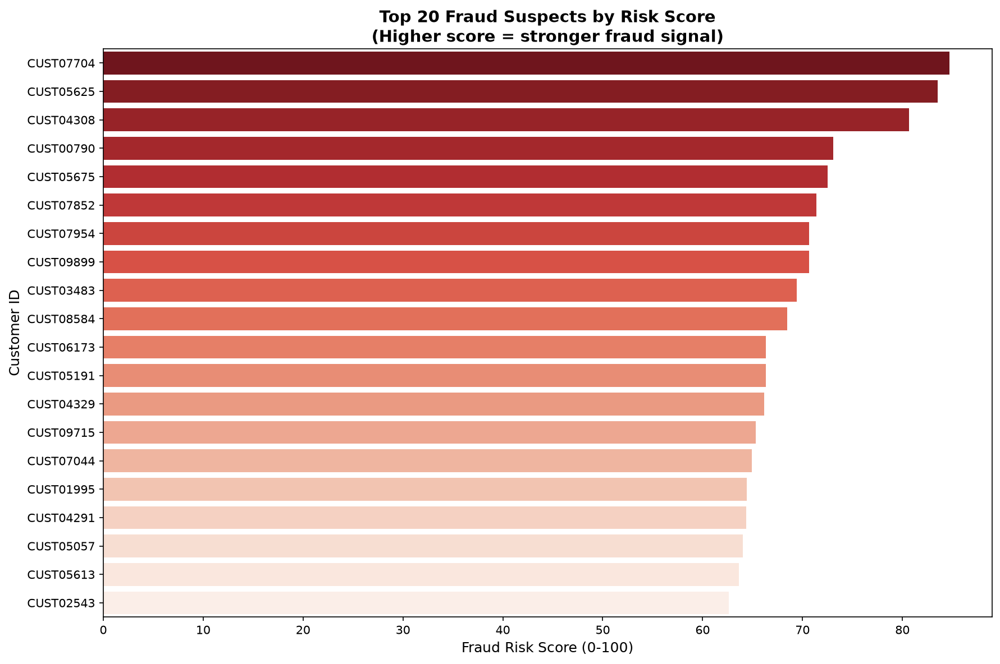
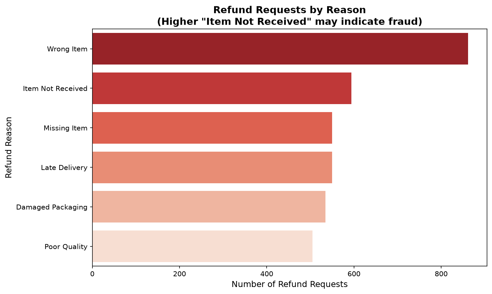

<div align="center">

# 🍽️ Zomato Refund Fraud Risk Analytics

**An end-to-end refund-abuse risk pipeline: seeded refund-layer generation →
behavioural risk scoring → SQL validation → interactive dashboards — with the
score validated against the planted ground truth.**

[🚀 Live Dashboard](https://zomato-refund-fraud-analytics-3xu24nq5hwbml78hkyirje.streamlit.app/) ·
[🧪 17 Automated Tests](tests/) ·
[📊 Score Validation](reports/score_validation.md) ·
[📄 Reports](reports/)

</div>

> ⚠️ **Honesty note:** the delivery data is real (public Kaggle Zomato dataset),
> but the **refund layer — and therefore the "fraud" — is synthetic**, planted
> by a seeded generator. No real customers are implicated. This project
> demonstrates the *method*; full caveat in
> [`reports/assumptions_and_limitations.md`](reports/assumptions_and_limitations.md).

---

## 1. 🚀 Live Project

**Dashboard (Streamlit Community Cloud):**

> ### 👉 https://zomato-refund-fraud-analytics-3xu24nq5hwbml78hkyirje.streamlit.app/

**GitHub Repository:**

> ### 👉 https://github.com/rishi-1603/zomato-refund-fraud-analytics

A Power BI version (`dashboard/zomato_fraud_dashboard.pbix`) is also included.

---

## 2. 💼 Business Problem

Refund abuse costs platforms twice — the refund paid and the margin lost — and
reviewing every request manually doesn't scale. The fraud team needs a
**ranked, explainable watchlist**: which customers to investigate first, and
what behaviour put them there — while genuine customers keep getting their
refunds approved.

| Question | Where it's answered |
|---|---|
| Which customers have anomalous refund behaviour? | Risk score + tiers |
| How bad is the abuse concentration? | SQL + EDA: 279 customers >30% refund rate |
| Does the watchlist actually work? | **Validated vs planted ground truth** — not assumed |
| Where does the funnel leak? | Coverage analysis: the eligibility filter drops 56% of abusers |

---

## 3. 🔄 Project Overview

```
Real delivery dataset (45,584 orders, public Kaggle)
        ↓  notebook 01 (seed 42 — reproducible)
Synthetic refund layer + 10,000 customers (risk categories planted)
        ↓  notebook 02 — EDA        notebook 03 — risk scoring
        ↓  scripts/validate_risk_score.py — score vs planted truth
        ↓  sql/fraud_queries.sql — PostgreSQL business queries
        ↓  dashboard/app.py (Streamlit, live) + Power BI
        ↓
Ranked watchlist + honest performance metrics + business recommendations
```

---

## 4. 📦 Dataset

| Component | Source | Rows |
|---|---|---|
| Delivery/logistics columns | **Real** — public Kaggle Zomato dataset | 45,584 orders |
| Customer_ID + refund columns | **Synthetic** — seeded generator (notebook 01) | 10,000 customers |
| Planted ground truth | Recovered by replaying the seed | High 299 · Medium 711 · Low 8,990 |

Column-by-column documentation: [`data/DATA_DICTIONARY.md`](data/DATA_DICTIONARY.md)

---

## 5. 🛠 Tech Stack

| Layer | Tools |
|---|---|
| **Analysis** | Python · pandas · NumPy · Matplotlib/Seaborn |
| **Scoring** | scikit-learn (MinMax scaling) — composite weighted heuristic |
| **Database** | PostgreSQL · SQL (8 documented business queries) |
| **Dashboards** | Streamlit (live) · Power BI (.pbix) |
| **Quality** | pytest (17 tests) · GitHub Actions CI |
| **Workflow** | Jupyter notebooks (seeded, portable paths) |

---

## 6. 🗄️ SQL Layer

[`sql/fraud_queries.sql`](sql/fraud_queries.sql) — 8 PostgreSQL queries, each
labelled with its business question:

1. Overall refund summary (KPIs)
2. Top fraud suspects by refund rate
3. Repeated refund reasons per customer (fraud signal #2)
4. Refund reason distribution
5. Refund amount analysis
6. City-wise refund comparison
7. High-risk customer identification
8. Business KPI report

Techniques: conditional aggregation (`CASE WHEN` inside `SUM`), `HAVING`
thresholds, window-style ranking, subqueries, KPI rollups.

---

## 7. 🧩 The Risk Score (and its honest evaluation)

**Methodology** (full formula: [`docs/risk_scoring_methodology.md`](docs/risk_scoring_methodology.md)):
eligible pool = ≥5 orders AND >30% refund rate (279 customers) → four signals
(refund rate 40% · reason repetition 30% · refund frequency 20% · reason length
10%), min-max scaled → composite 0–100 → tiers Low ≤40 < Medium ≤70 < High.

**Validation against the planted ground truth** — the step most fraud projects
skip. Because the generator is seeded, the planted risk labels are recoverable,
so the score is *measured*, not assumed:

| Metric | Value | Reading |
|---|---|---|
| High-tier precision | **100%** | Every customer in the top tier is a planted abuser |
| In-pool AUC | **0.942** | Ranking quality is excellent within the pool |
| End-to-end recall | **2.7%** | **The funnel catches only 8 of 299 planted abusers** |
| Pool coverage | 43.8% | The ≥5-order filter drops 56% of abusers pre-scoring |

**The honest headline:** a perfectly precise watchlist that misses most of the
problem — because eligibility thresholds trade coverage for confidence. That
tradeoff is now quantified, and the recommended fix (score everyone with ≥1
refund) is in the decision log. Regenerate: `python scripts/validate_risk_score.py`.

---

## 8. 💡 Key Insights

### Insight 1 — Abuse is concentrated, so review effort should be too
279 customers (2.8%) exceed 30% refund rates; the High tier is 100% precise
against planted labels.
**Pareto analysis quantifies it:** the top 10% of customers hold **75.6%** of
refund value; just **292 customers (3.0%) cover half** of all exposure —
see [`reports/pareto_analysis.md`](reports/pareto_analysis.md).
**Action (on real data):** investigate the High tier top-down. *Owner: Fraud
team · KPI: confirmed-abuse rate per investigation.*

### Insight 2 — The funnel leaks before scoring begins
The ≥5-order eligibility rule excludes 56% of planted abusers (avg 4.6
orders/customer).
**Action:** lower eligibility to ≥1 refund; report end-to-end recall.
*Owner: Analytics · KPI: recall at fixed review capacity.*

### Insight 3 — Repetition is the behavioural tell
Planted abusers reuse the same reason ("Item Not Received") — in real fraud
work, reason-repetition is a classic scripted-claim signal, which is exactly
why it carries 30% weight here.

---


### Insight 4 — Refund exposure concentration (Pareto)
Top 1% of customers hold **26.9%** of refund value; top 10% hold **75.6%**;
80% of value comes from just **11.8%** of customers. This is the
review-queue-sizing answer — and concentration is a prioritization signal,
never proof of fraud. Full analysis:
[`reports/pareto_analysis.md`](reports/pareto_analysis.md).

## 9. 📸 Dashboard Preview

**[➡ Open the live dashboard](https://zomato-refund-fraud-analytics-3xu24nq5hwbml78hkyirje.streamlit.app/)**




*Filter by city/date/risk tier, drill into any account's score breakdown, and
export the watchlist — plus a Power BI version in `dashboard/`.*

---

## 10. 🏗 Project Architecture

```
zomato-refund-fraud-analytics/
├── data/
│   ├── raw/Zomato Dataset.csv           # real public dataset (immutable, CI-checked)
│   ├── processed/zomato_with_refunds.csv# + synthetic refund layer
│   ├── processed/ground_truth_customer_risk.csv  # recovered planted labels
│   └── DATA_DICTIONARY.md
├── notebooks/                           # 01 generation → 02 EDA → 03 scoring → 04 postgres
├── scripts/validate_risk_score.py       # score vs planted truth (the honesty layer)
├── sql/fraud_queries.sql                # 8 documented business queries
├── dashboard/
│   ├── app.py                           # Streamlit (live)
│   ├── zomato_fraud_dashboard.pbix      # Power BI
│   └── screenshots/
├── tests/                               # 17 checks: data quality + pipeline reproducibility
├── reports/                             # exec summary, methodology, limitations,
│                                        # decision log, score validation, suspects list
├── docs/risk_scoring_methodology.md     # the exact formula + threshold rationale
└── .github/workflows/ci.yml             # CI: tests on every push
```

---

## 11. ▶️ How to Run

```bash
git clone https://github.com/rishi-1603/zomato-refund-fraud-analytics.git
cd zomato-refund-fraud-analytics
pip install -r requirements.txt

streamlit run dashboard/app.py          # the dashboard (data is committed — no setup)

python scripts/validate_risk_score.py   # regenerate the validation report
python -m pytest tests/ -v              # 17 checks

# notebooks run end-to-end with relative paths (01 → 04)
# SQL: load to PostgreSQL via notebooks/04, then run sql/fraud_queries.sql
```

---

## 12. 🎓 Key Learnings

- **Fraud scoring without labels still needs validation** — recovering the
  generator's planted ground truth turned "I built a score" into "I measured
  it: 100% precision, 2.7% recall, here's the coverage gap"
- **Thresholds are business decisions** — every cutoff (orders, rate, score)
  trades coverage for confidence and must be reported with both sides
- **Relative scores need absolute anchors** — MinMax-normalized tiers drift
  as the pool changes; ops thresholds should be frozen separately
- **Reproducibility is a habit** — seeding the generator is what made ground
  truth recoverable and the whole pipeline testable

---

## 13. 🔮 Future Improvements

- Score **all** customers with ≥1 refund (fix the coverage gap) and report
  end-to-end recall at fixed review capacity
- Calibrate the score into a genuine abuse probability (logistic on
  investigator outcomes, once real labels exist)
- Precision@k curves for the watchlist instead of a single tier cutoff
- Drift monitoring: refund-rate distribution per week, tier-size stability
- Cost-sensitive thresholding (false-positive cost ≠ false-negative cost)

---

## 👨‍💻 Author

**Rishi Dappu** — B.Tech CSE (Data Science)
📧 rishidappu16@gmail.com · 🔗 [LinkedIn](https://www.linkedin.com/in/rishidappu1603/) · 💻 [GitHub](https://github.com/rishi-1603)

<div align="center">

**⭐ Star this repo if it helped you ·
[🚀 Open the Live Dashboard](https://zomato-refund-fraud-analytics-3xu24nq5hwbml78hkyirje.streamlit.app/) ⭐**

</div>
